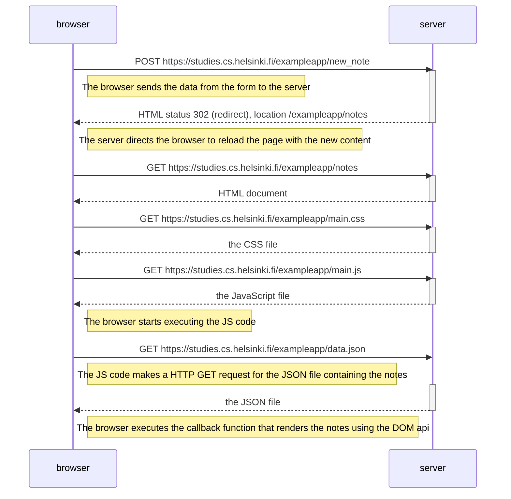

```mermaid
sequenceDiagram
    participant browser
    participant server

    browser->>server: POST https://studies.cs.helsinki.fi/exampleapp/new_note
    activate server

    note right of browser: The browser sends the data from the form to the server

    server-->>browser: HTML status 302 (redirect), location /exampleapp/notes
    deactivate server

    note right of browser: The server directs the browser to reload the page with the new content

    browser->>server: GET https://studies.cs.helsinki.fi/exampleapp/notes
    activate server
    server-->>browser: HTML document
    deactivate server

    browser->>server: GET https://studies.cs.helsinki.fi/exampleapp/main.css
    activate server
    server-->>browser: the CSS file
    deactivate server

    browser->>server: GET https://studies.cs.helsinki.fi/exampleapp/main.js
    activate server
    server-->>browser: the JavaScript file
    deactivate server

    note right of browser: The browser starts executing the JS code

    browser->>server: GET https://studies.cs.helsinki.fi/exampleapp/data.json

    note right of browser: The JS code makes a HTTP GET request for the JSON file containing the notes

    activate server
    server-->>browser: the JSON file
    deactivate server

    note right of browser: The browser executes the callback function that renders the notes using the DOM api
```
