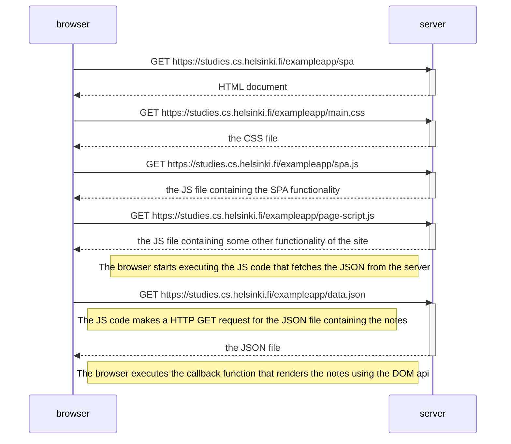

```mermaid
sequenceDiagram
    participant browser
    participant server

    browser->>server: GET https://studies.cs.helsinki.fi/exampleapp/spa
    activate server
    server-->>browser: HTML document
    deactivate server
    
    browser->>server: GET https://studies.cs.helsinki.fi/exampleapp/main.css
    activate server
    server-->>browser: the CSS file
    deactivate server

    browser->>server: GET https://studies.cs.helsinki.fi/exampleapp/spa.js
    activate server
    server-->>browser: the JS file containing the SPA functionality
    deactivate server

    browser->>server: GET https://studies.cs.helsinki.fi/exampleapp/page-script.js
    activate server
    server-->>browser: the JS file containing some other functionality of the site
    deactivate server

    note left of server: The browser starts executing the JS code that fetches the JSON from the server

    browser->>server: GET https://studies.cs.helsinki.fi/exampleapp/data.json
    activate server

    note right of browser: The JS code makes a HTTP GET request for the JSON file containing the notes

    server-->>browser: the JSON file
    deactivate server

    note right of browser: The browser executes the callback function that renders the notes using the DOM api
```
