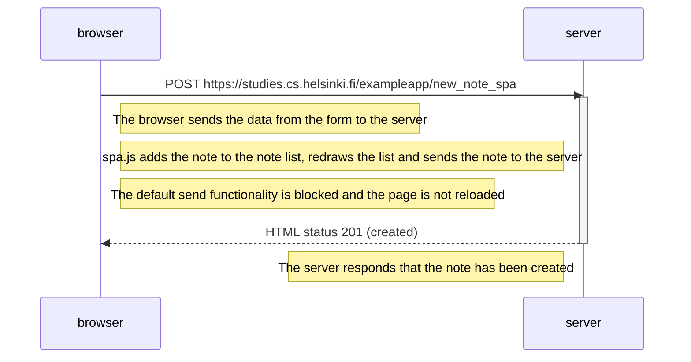

```mermaid
sequenceDiagram
    participant browser
    participant server

    browser->>server: POST https://studies.cs.helsinki.fi/exampleapp/new_note_spa
    activate server

    note right of browser: The browser sends the data from the form to the server
    note right of browser: spa.js adds the note to the note list, redraws the list and sends the note to the server
    note right of browser: The default send functionality is blocked and the page is not reloaded

    server-->>browser: HTML status 201 (created)
    deactivate server

    note left of server: The server responds that the note has been created
```
